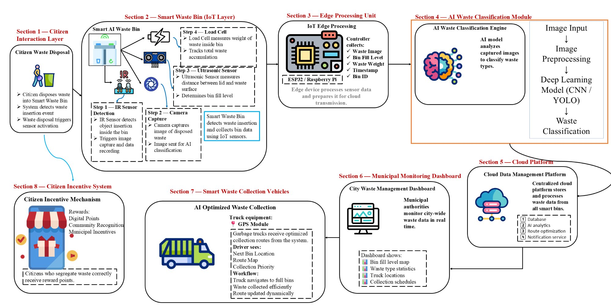
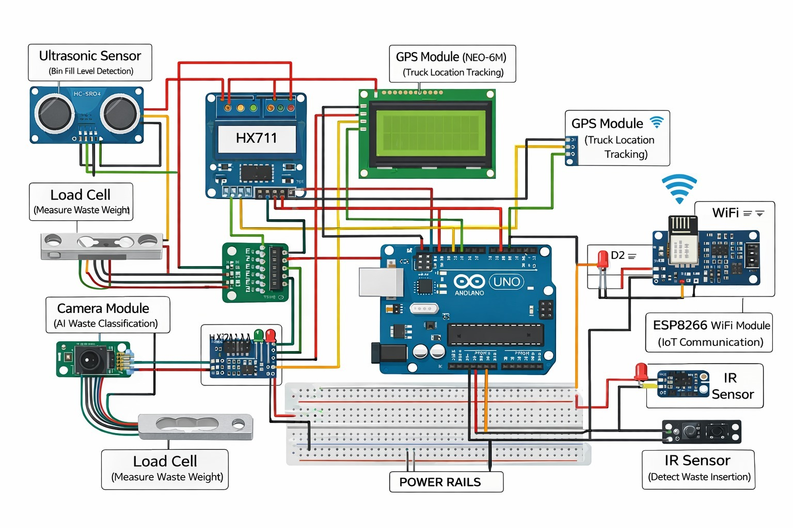

# AI-powered Smart Waste Management System

> **Smart Waste Management Using AI, IoT, and Intelligent Route Optimization**

A full-stack **AI + IoT based Smart Waste Management Platform** that monitors waste bins, classifies waste using computer vision, and optimizes garbage truck routes using real-time data. The system integrates **smart bins, edge AI, cloud backend, route optimization algorithms, and a municipal monitoring dashboard**.

---

## 📌 Table of Contents

- [Overview](#overview)
- [Problem Statement](#problem-statement)
- [Proposed Solution](#proposed-solution)
- [System Architecture](#system-architecture)
- [Hardware Components](#hardware-components)
- [Technologies Used](#technologies-used)
- [System Workflow](#system-workflow)
- [Project Structure](#project-structure)
- [Getting Started](#getting-started)
- [Dashboard Features](#dashboard-features)
- [Expected Impact](#expected-impact)
- [Future Improvements](#future-improvements)
- [License](#license)

---

## 🌐 Overview

Urban cities generate massive amounts of municipal waste every day. Traditional waste management systems rely heavily on **manual monitoring and fixed garbage collection routes**, which often results in overflowing bins, inefficient waste collection, and increased environmental pollution.

The **AI-Driven Circular Waste Intelligence System** introduces a **data-driven smart waste ecosystem** that automatically monitors bins, classifies waste, and optimizes garbage collection operations.

This platform integrates:

- IoT smart bins with multiple sensors
- AI-based waste classification using computer vision
- Real-time telemetry using MQTT and REST APIs
- Cloud backend for data processing and storage
- Route optimization algorithms for garbage trucks
- Municipal monitoring dashboard

---

## ⚠️ Problem Statement

Urban waste management systems face several critical challenges:

- Lack of waste segregation at the source
- Overflowing garbage bins in public areas
- Fixed garbage collection routes regardless of bin status
- High operational and fuel costs
- Increased landfill waste and environmental pollution

Without intelligent monitoring systems, municipal authorities cannot make **real-time, data-driven decisions**, leading to inefficient waste management operations.

---

## 💡 Proposed Solution

The proposed system introduces a **smart circular waste intelligence platform** powered by **Artificial Intelligence and Internet of Things (IoT)** technologies, transforming traditional waste management into an **automated, intelligent, and data-driven process**.

### Key Features

- Smart waste bins with multiple environmental sensors
- AI-based waste classification using camera and YOLO model
- Real-time telemetry using MQTT protocol
- Cloud backend for data ingestion and processing
- Intelligent garbage truck route optimization
- Municipal monitoring dashboard for city operators
- Simulation tools for testing the system without physical hardware

---

## 🏗️ System Architecture

The system consists of **eight interconnected layers** — from citizen interaction at the bin level, all the way to cloud processing, dashboard monitoring, and citizen incentives.



> *Full end-to-end system architecture: Citizen Interaction → Smart Bin IoT Layer → Edge Processing → AI Classification → Cloud Platform → Municipal Dashboard → Smart Collection Vehicles → Citizen Incentive System*

---

### Architecture Overview

### 1. Smart Waste Bin (IoT Device)

Smart bins use sensors and microcontrollers to monitor bin status.

| Sensor | Purpose |
|---|---|
| Ultrasonic Sensor | Bin fill level |
| Load Cell + HX711 | Waste weight |
| IR Sensor | Waste insertion detection |
| MQ135 | Gas detection |
| DHT11 | Temperature & humidity |

Firmware runs on **ESP32**, sending telemetry to the backend.

---

### 2. Edge AI Waste Classification

A **Raspberry Pi camera module** captures images of disposed waste. Images are processed using **YOLOv8 computer vision model** to classify waste types:

- Plastic
- Paper
- Metal
- Organic
- Hazardous

Classification results are sent to the backend.

---

### 3. Cloud Backend

The backend is built using **FastAPI** and handles:

- Receiving sensor telemetry from bins
- Storing data in PostgreSQL database
- Triggering alerts when bins are full or gas levels are high
- Storing waste classification results
- Computing optimal garbage truck routes

---

### 4. Route Optimization System

The backend uses **graph-based shortest path algorithms** to calculate optimized routes for garbage trucks — only visiting bins that require collection.

**Endpoint:**
```
POST /routes/optimize
```

**Returns:**
- List of bins requiring pickup
- Optimized route order
- Estimated travel distance

---

### 5. Monitoring Dashboard

A municipal web dashboard visualizes:

- Smart bin locations
- Waste fill levels
- Waste classification statistics
- Garbage truck positions
- Alerts and notifications

---

## 🔩 Hardware Components

The prototype uses low-cost IoT hardware components to monitor smart waste bins, classify waste using AI vision, and track collection vehicles in real time.

---

### 1. Microcontroller

**ESP32 Development Board**

Main controller used to process sensor data, run edge logic, and transmit information to the cloud using built-in Wi-Fi and Bluetooth.

---

### 2. Waste Fill Level Sensor

**HC‑SR04 Ultrasonic Sensor**

Measures the distance between the sensor and the waste surface to determine the bin fill level.

- Detects when the bin becomes full
- Triggers collection alerts

---

### 3. Waste Weight Sensor

**Load Cell + HX711 Load Cell Amplifier**

- Measures weight of waste inside the bin
- Helps estimate waste generation rate

---

### 4. Waste Insertion Detection

**IR Obstacle Sensor**

- Detects when waste is inserted into the bin
- Triggers camera capture for AI classification

---

### 5. AI Vision Sensor

**ESP32‑CAM Module**

- Captures images of waste items
- Used for AI-based waste classification

**Classification Categories:**
- Biodegradable
- Recyclable
- Hazardous

---

### 6. Location Tracking

**NEO‑6M GPS Module**

- Tracks waste collection trucks
- Enables route optimization and fleet monitoring

---

### 7. IoT Connectivity

**ESP8266 Wi‑Fi Module** *(optional, if using a separate communication module)*

- Sends sensor data to cloud dashboard
- Enables real-time monitoring

---

### Hardware Summary Table

| # | Component | Purpose |
|---|---|---|
| 1 | ESP32 Development Board | Smart bin microcontroller |
| 2 | HC‑SR04 Ultrasonic Sensor | Bin fill level |
| 3 | Load Cell + HX711 | Waste weight measurement |
| 4 | IR Obstacle Sensor | Waste insertion detection |
| 5 | ESP32‑CAM Module | Waste image capture for AI classification |
| 6 | NEO‑6M GPS Module | Garbage truck location tracking |
| 7 | MQ135 Gas Sensor | Gas / odor detection |
| 8 | DHT11 | Temperature & humidity monitoring |
| 9 | ESP8266 Wi‑Fi Module | IoT cloud connectivity (optional) |

---

### 🔌 Wiring / Circuit Diagram

The diagram below shows all hardware connections between the microcontroller, sensors, and communication modules.



> *Wiring connections: Arduino UNO as the central controller connected to HC-SR04 Ultrasonic Sensor, Load Cell + HX711 amplifier, IR Sensor, Camera Module, NEO-6M GPS Module, ESP8266 Wi-Fi Module, and Power Rails via breadboard.*

---

## 🛠️ Technologies Used

### Programming
- Python

### Backend
- FastAPI
- SQLAlchemy
- PostgreSQL

### IoT Communication
- MQTT (Eclipse Mosquitto)

### Artificial Intelligence
- YOLOv8
- OpenCV
- TensorFlow / PyTorch

### IoT Hardware
- ESP32, Raspberry Pi
- Ultrasonic Sensor (HC-SR04)
- Load Cell + HX711
- IR Sensor, MQ135 Gas Sensor, DHT11

### Visualization
- HTML / CSS / JavaScript
- Streamlit / Plotly

### Containerization
- Docker, Docker Compose

---

## 🔄 System Workflow

```
1. Citizen disposes waste into smart bin
       ↓
2. IR sensor detects waste insertion
       ↓
3. Camera captures waste image
       ↓
4. AI model classifies waste type
       ↓
5. Sensors measure bin fill level and weight
       ↓
6. Telemetry sent to backend via MQTT / REST API
       ↓
7. Backend stores data in PostgreSQL
       ↓
8. Route optimizer identifies bins requiring pickup
       ↓
9. Garbage truck receives optimized route
       ↓
10. Dashboard displays system data in real time
```

---

## 📁 Project Structure

```
├── docker-compose.yml
├── LICENSE
├── README.md
├── STRUCTURE.md
├── ai_service/
│   ├── Dockerfile
│   ├── README.md
│   ├── requirements.txt
│   ├── train_trashnet.py
│   ├── train_waste_classifier_yolov8.py
│   ├── train_waste_yolov8.py
│   ├── app/
│   │   ├── __init__.py
│   │   ├── main.py
│   │   └── waste_classifier.py
│   └── datasets/
│       ├── trashnet.yaml
│       └── DATASET/…
├── backend/
│   ├── Dockerfile
│   ├── README.md
│   ├── requirements.txt
│   ├── app/
│   │   ├── __init__.py
│   │   ├── main.py
│   │   ├── schemas.py
│   │   ├── api/
│   │   │   ├── router.py
│   │   │   └── routes/…
│   │   ├── core/
│   │   │   └── config.py
│   │   └── db/
│   │       ├── base.py
│   │       ├── models.py
│   │       └── session.py
│   └── services/…
├── devices/
│   ├── mqtt_backend/…
│   ├── raspi_waste_classifier/…
│   └── truck_gps_tracker/…
├── firmware/
│   └── esp32/smart_waste_bin/
├── frontend/
│   ├── docker-compose.yml
│   ├── Dockerfile
│   ├── index.html
│   ├── mockData.js
│   ├── package.json
│   ├── README.md
│   ├── server.js
│   ├── tsconfig.json
│   ├── vite.config.ts
│   ├── images/
│   └── src/…
├── infra/
│   └── mosquitto/
├── sensorsTesting/…
├── simulator/…
```

---

## 🚀 Getting Started

### Run with Docker (Recommended)

Start the entire platform with a single command:

```bash
docker compose up --build
```

**Services started:**
- PostgreSQL database
- MQTT broker
- FastAPI backend
- AI classification service
- Dashboard frontend

---

### Local Development

**Run backend:**
```bash
pip install -r requirements.txt
uvicorn backend.app.main:app --reload
```

**Run simulators** *(generates virtual sensor data without real hardware)*:
```bash
python simulator/smart_bin_simulator.py
python simulator/truck_simulator.py
```

---

## 📊 Dashboard Features

The municipal monitoring dashboard provides:

- Real-time smart bin status
- Waste type distribution analytics
- Map visualization of bin locations
- Optimized garbage collection routes
- Garbage truck GPS tracking
- Alerts for full bins or gas leaks

---

## 🌍 Expected Impact

The AI-Driven Circular Waste Intelligence System helps cities:

- Improve waste segregation efficiency
- Reduce landfill waste
- Optimize garbage collection routes
- Lower fuel consumption and operational costs
- Enable data-driven municipal decision making

---

## 🔮 Future Improvements

- AI prediction of waste generation trends
- Automated robotic waste sorting
- Integration with smart city IoT infrastructure
- Citizen reward system for proper waste segregation

---

## 📄 License

This project is licensed under the **MIT License**. See the [LICENSE](LICENSE) file for details.

---

<p align="center">
  Built with ❤️ for smarter, cleaner cities
</p>
